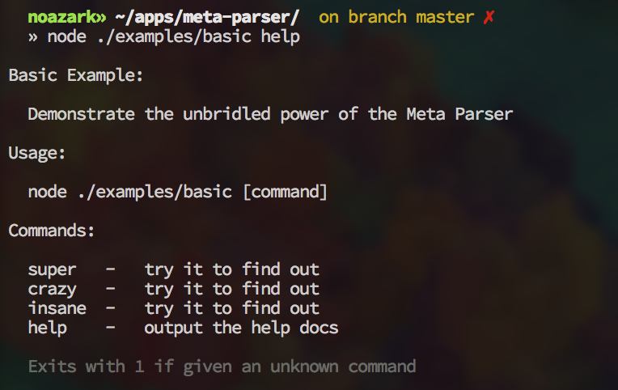

Meta Parser
===========

Take comments from the head of a file and turn it into beautiful CLI ready text.
This is primarily used for documentation of CLI tools.

## Example:
```javascrpit
#!/usr/bin/env node
// # Basic Example
//
// Demonstrate the unbridled power of the Meta Parser
//
// ## Usage
// ```
// node ./examples/basic [command]
// ```
//
// ## Commands
// super - try it to find out
// crazy - try it to find out
// insane - try it to find out
// help - output the help docs
//
// > Exits with 1 if given an unknown command
//

var metaParser = require('meta-parser')
var command = process.argv[2]

var helpDocs = metaParser(__filename)

if (command === 'super') {
	console.log('something totally cool')
} else if (command === 'crazy') {
	console.log('brains may explode')
} else if (command === 'insane') {
	console.log('if words could explain')
} else if (command === 'help') {
	console.log(helpDocs)
} else {
	console.log('unknown command')
	process.exit(1)
}

process.exit(0)

```

**Result**

